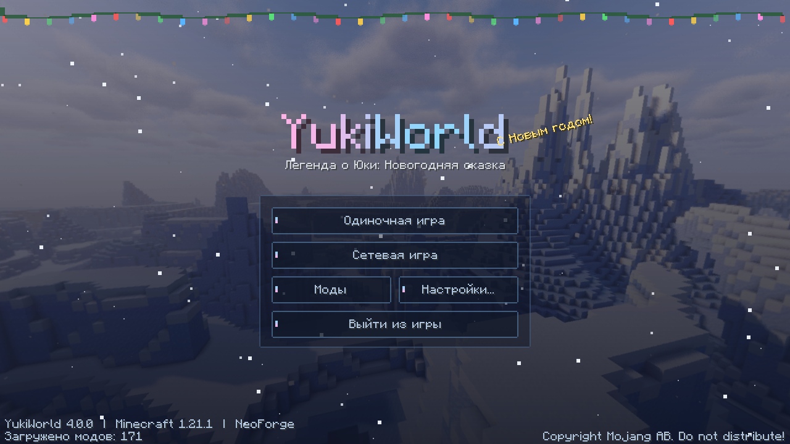
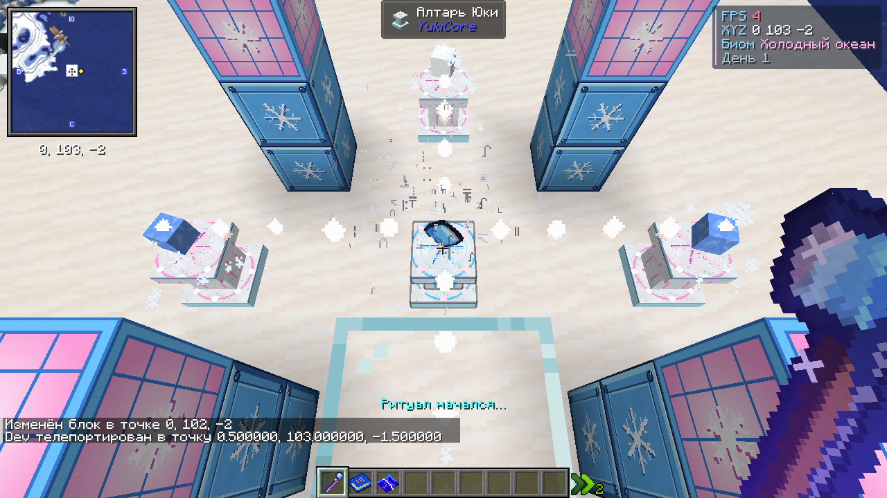

# ❄ YukiWorld 3.0 — Легенда о Юки: Звёздный путь

Большая «kitchen-sink» сборка в духе **All The Mods** для **Minecraft 1.21.1 / NeoForge 21.1.265**:
**131 мод**, сюжетная книга квестов на **505 квестов** (4 акта, 30 глав), **космос с пятью своими
планетами и боссами**, мультиструктура **Алтарь Юки** в три уровня и HD-текстуры **64×64**.



## 📖 Сюжет

> Когда-то над всеми мирами шёл тихий снег. Его хранила **Юки** — дух зимы. Эндер-дракон расколол её
> Сердце, но настоящим врагом оказалась **Тень Юки** — проклятие, рождённое из осколков. Тень унесла силу
> Юки к далёкой звезде, в **Систему Юки**, и поселила на пяти планетах стражей.
>
> Ты — **Хранитель**. Освой машины и магию Земли, пройди иные миры и их чудовищ, построй ракету,
> победи стражей планет, собери Сердце, зажги Бесконечную звезду и в последней битве на Целестии
> освободи Юки.

Сюжет рассказывают письма Юки в начале каждой главы квестов и книга **«Летопись Юки»** (Patchouli).

## 📜 Квесты: 505 квестов, 4 акта, строго по очереди

| Акт | Главы |
|---|---|
| **I · Земля** | Пролог · Create · Сталь и пар (IE, Mekanism) · Магия (Ars, Iron's) · Тайное (Occultism, EvilCraft, Apotheosis) · Сад и улей · Цифровой мир (AE2, RS) · Энергия (Powah, реакторы) |
| **II · Иные миры** | Пороги миров · Подземье (Undergarden) · Сумеречные хроники (все боссы TF) · Небесные подземелья (Aether, Deep Aether) · Вечный звёздный свет (Eternal Starlight) · Охота на чудовищ (Mowzie's, BoMD, Aquamirae, Bosses'Rise, Iron's) · Катаклизм (все боссы Cataclysm) · Край света · Ледяная кузня · Алтари Юки |
| **III · Звёздный путь** | Космическая программа · Луна · Марс · Венера и Меркурий · Глацио · ❄ Юкия · 💜 Аврора · 🌋 Пиролит · 🌑 Никта |
| **IV · Сердце зимы** | Четыре Ядра · Сердце и Бесконечная звезда · ☀ Целестия: битва с Тенью Юки и эпилог |

Задачи: «принеси», **«победи босса»** (≈60 боссов из 12 модов) и **«посети мир»** (17 измерений).

## 🚀 Космос и Система Юки

Ad Astra (ракеты I–IV, скафандры, кислород, Луна, Марс, Венера, Меркурий, Глацио) + **пять своих планет**
YukiCore — они прямо в меню ракеты, раздел «Система Юки» (ракета IV уровня):

| Планета | Мир | Руда → материал | Страж (босс) | Трофей |
|---|---|---|---|---|
| ❄ **Юкия** | лёд, снег, можно дышать | вечная мерзлота | **Ледяной Колосс** · 600 ❤ | Сердце Колосса |
| 💜 **Аврора** | аметист и кальцит | аврора | **Королева Метелей** · 750 ❤ | Корона Метели |
| 🌋 **Пиролит** | базальт, лава, 280° | пиролит | **Пепельный Владыка** · 900 ❤ | Пепельное ядро |
| 🌑 **Никта** | скалк, вечная ночь, −180° | пустота | **Пустотный Змей** · 1000 ❤ | Чешуя Пустоты |
| ☀ **Целестия** | золотой свет | звёздная руда | **Тень Юки** · 1600 ❤ | Слеза Юки |

Боссов призывают **Печати**, созданные на Алтаре, и печать работает только на «своей» планете.
У каждого босса полоса здоровья, свои атаки (клыки, удары по земле, огненные новы, снаряды шалкеров,
телепорты, молнии, свита) и **фаза ярости** ниже 50% здоровья.

| Боссы | Ледяной Колосс на Юкии |
|---|---|
|  |  |

## 🏛 Мультиструктура «Алтарь Юки»

Предметы кладутся на алтарь и пьедесталы, ритуал запускается **Морозным жезлом**. Ритуалы видны
в **JEI** (своя категория), схемы уровней — в Летописи в 3D.

| Уровень | Структура | Что открывает |
|---|---|---|
| **I · Морозный** | алтарь + 4 пьедестала + 4 колонны (мороз ×2 + лампа) | эссенция, яблоки, звёздный свет, Печать Колосса |
| **II · Звёздный** | 8 пьедесталов, колонны из целестия и звёздного света | печати стражей, **книги выше максимума** (Острота VII, Эффективность VII, Защита VI…), калорит из пиролита, звезда Незера |
| **III · Бесконечность** | + 4 обелиска в 6 блоках | Печать Тени, **Корона Юки**, **Клинок Вечной Зимы** |

| Ритуал | JEI | Летопись |
|---|---|---|
|  |  |  |

Также в сборке мультиблоки других модов, через которые идут квесты: коксовая и доменная печи IE,
SPS и термоядерный реактор Mekanism, нитро-реактор Powah, механические крафтеры Create до 9×9.

## ⭐ Финальная цепочка (112 рецептов YukiCore)

```
Руды Энда → Мороз → (Create: смешивание с перегревом) Ауроний → (Powah: 25 млн FE) Целестий
Морозное ядро (5×5) ─┬─ ⚙ Технологическое · ✨ Магическое · 🌾 Природы · 🌌 Измерений   (7×7, все моды)
Стражи Системы Юки ──┴─ Сердце Колосса · Корона Метели · Пепельное ядро · Чешуя Пустоты
 4 Ядра + 4 трофея + 4 антиматерии + 8 осколков звезды (9×9) ──► ❤ Сердце YukiWorld
 Сердце + сияние/теневая сталь + сингулярности (9×9) → нуклеосинтез Mekanism ──► ⭐ Бесконечная звезда
 Алтарь III: трофеи + звёздный свет ──► Печать Тени ──► ⚔ Тень Юки на Целестии ──► Слеза Юки
 Алтарь III: Слеза + блоки всех планет ──► 👑 Корона Юки (полёт, сопротивление III, все бонусы)
```
Бесконечная звезда — ключ к креативным предметам Mekanism, AE2, Powah, IE и Create (не тратится).

## 🎨 HD-текстуры

Все предметы и блоки YukiCore нарисованы заново в **64×64**: гладкие края, объём, блики, огранённые
кристаллы в рудах, металлические блоки с фаской и снежинкой. Боссы — HD-скины 2–4×.


## Установка (игроку)
1. Скачай `YukiWorld-3.0.0.mrpack` (GitHub Actions → артефакт **YukiWorld**).
2. Открой в **Prism Launcher** / **Modrinth App** / **ATLauncher**.
3. Выдели **10–12 ГБ ОЗУ**, **Java 21**.

> ⚠️ 3.0 — новая версия: новые квесты и рецепты. Начинай **новый мир**.

## Сборка (разработчику)
```bash
python3 yukiworld/tools/gen_assets.py      # HD-текстуры, рецепты, планеты, лут, книга
python3 yukiworld/tools/gen_quests.py      # 505 квестов → pack/config/ftbquests
cd yukiworld/yukicore && ./gradlew build   # мод (JEI API подключается из maven.blamejared.com)
bash yukiworld/pack/scripts/build-pack.sh  # .mrpack (нужен packwiz)
```
`gen_assets.py` использует ванильные текстуры мобов из кэша Gradle и данные Ad Astra (рельеф Глацио) —
пути заданы в начале файла.

```
yukiworld/tools/yukigen/
├── hd.py          # HD-конвейер: апскейл Scale2x, объём, процедурные блоки, скины боссов
├── art.py         # маски предметов и палитры
├── recipes.py     # все рецепты (Create, AE2, Ars, Powah, Mekanism, алтарь)
├── planets.py     # Система Юки для Ad Astra
├── book.py        # Летопись Юки (с 3D-схемами алтаря)
├── questbook.py   # главы I–XII
└── questbook3.py  # новые главы 3.0, акты и порядок
```

made by YukiTo ❄
